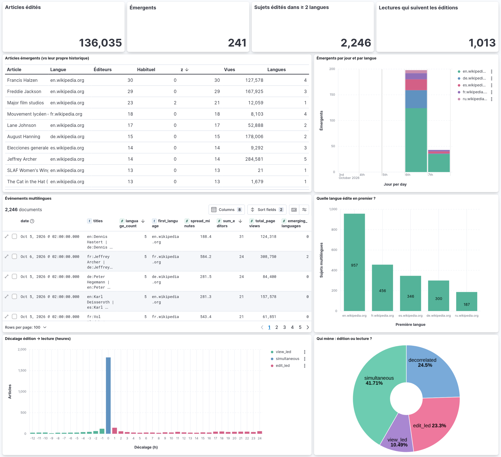
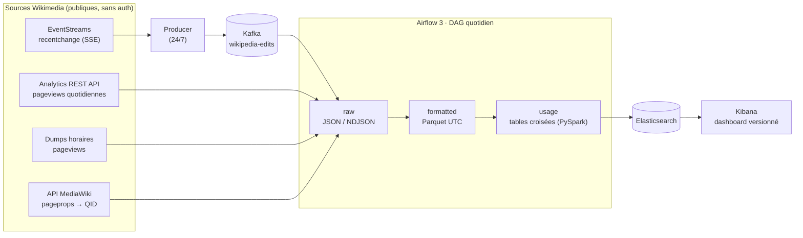
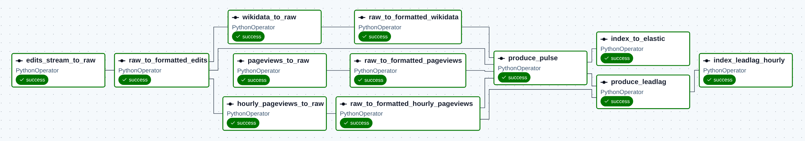

<div align="center">

# Wikipedia Pulse

**Détecter les événements mondiaux au moment où ils émergent, en croisant ce que Wikipedia écrit avec ce que le monde lit.**

[](https://github.com/AmidNova/wikipedia-pulse/actions/workflows/ci.yml)


[](LICENSE)

<br/>



<sub>Dashboard Kibana sur 5 jours de données réelles (3–7 octobre 2026)</sub>

</div>

---

## L'idée

Quand un événement survient, les éditeurs Wikipedia réagissent en quelques minutes ; le grand
public suit, des heures plus tard. Wikipedia Pulse exploite ce décalage :

- **les éditions** (flux temps réel) sont l'**indicateur avancé** : qui écrit, sur quoi, dans quelles langues ;
- **les pages vues** (batch horaire et quotidien) sont l'**indicateur retardé** : ce que le monde lit.

Le pipeline croise les deux chaque jour sur **5 éditions de Wikipedia** (EN, FR, DE, ES, RU) et répond à trois questions :

| Question | Résultat |
| --- | --- |
| Quels articles sortent brutalement de leur comportement habituel ? | `TrendingArticles` : détection robuste par article |
| Quels sujets traversent les frontières linguistiques ? | `CrossLanguageEvents` : regroupement par entité Wikidata |
| Les lecteurs suivent-ils les éditeurs, et avec quel retard ? | `EditLeadLagHourly` : corrélation croisée heure par heure |

## Résultats

Sur 5 jours de fonctionnement (3–7 octobre 2026) :

| | |
| --- | --- |
| **212 788** éditions captées | **136 035** couples article × jour analysés |
| **241** articles émergents | **2 246** sujets édités dans au moins 2 langues |

**Un cas concret : Jeffrey Archer (`Q313489`).** Le 5 octobre au soir, l'article est édité en
anglais puis en français : 2 langues, rien d'anormal. Le 6 octobre, le sujet se propage aux
**5 langues** en moins de 10 h, en partant du français à 07:32 UTC : 50 éditions, 24 éditeurs
distincts et **308 750 lectures** cumulées. Le pipeline le marque émergent en anglais
(14 éditeurs contre une médiane habituelle de 0) et en allemand.

**Qui mène, l'écriture ou la lecture ?** Sur les 4 347 articles assez édités pour mesurer un
décalage horaire :

| Profil | Part | Décalage médian | Ce que ça veut dire |
| --- | --- | --- | --- |
| `simultaneous` | 42 % | 0 h | Éditeurs et lecteurs réagissent dans la même heure |
| `edit_led` | 23 % | **+12 h** | Les lectures suivent les éditions avec une demi-journée de retard |
| `decorrelated` | 25 % | n/a | Maintenance éditoriale sans écho dans l'audience |
| `view_led` | 10 % | −4 h | L'audience arrive d'abord, les éditeurs suivent |

Quand les éditions mènent, la courbe des lectures reproduit celle des éditions avec 12 h de
retard en médiane, et le pic de lectures atteint environ 6 fois le trafic horaire habituel de
l'article. C'est le signal avancé que le projet cherche à capter.

> Ces chiffres couvrent une semaine : les lignes de base par article (28 jours) n'étaient pas
> encore remplies, d'où beaucoup de médianes habituelles à 0. La détection se resserre à mesure
> que l'historique s'accumule.

## Architecture



Le producer écoute le flux SSE en continu et pousse chaque édition dans Kafka. Une fois par jour,
Airflow vide le topic, récupère les pages vues et les QID Wikidata, puis fait passer le tout par
les trois couches du datalake avant l'indexation.

## Le DAG



<sub>Run du 7 octobre 2026 dans Airflow 3 : 12 tâches, 13 min 33 s de bout en bout.</sub>

| Tâche | Rôle |
| --- | --- |
| `edits_stream_to_raw` | Vide le topic Kafka jusqu'aux offsets de fin et écrit les éditions par jour |
| `pageviews_to_raw` | Récupère le top des pages vues (sert au rang) ; réessaie tant que J n'est pas publié |
| `hourly_pageviews_to_raw` | Lit en streaming les 24 dumps horaires et ne garde que les articles édités |
| `wikidata_to_raw` | Associe chaque article édité à son QID (50 titres par requête) |
| `raw_to_formatted_*` | Normalise chaque source en Parquet, dates en UTC |
| `produce_pulse` | Croise éditions, vues et QID ; détecte les émergents par rapport à leur propre historique |
| `produce_leadlag` | Corrélation éditions × vues sur 48 h pour le jour J-1 |
| `index_*` | Pousse les tables `usage` dans Elasticsearch |

`produce_pulse` attend les dumps horaires (publiés vers J+1 02:00) : ce sont eux qui donnent
les vues de **tous** les articles édités, alors que le top de l'API n'en couvre que ~2 %.
Wikidata est un enrichissement : si l'API tombe, `produce_pulse` tourne quand même
(`trigger_rule="all_done"`) et le run reste marqué en échec.

## Datalake

Chemins normalisés : `datalake/{layer}/{group}/{Table}/{date}/fichier`

| Layer | Group | Table | Contenu |
| --- | --- | --- | --- |
| raw | `wikimedia_stream` | `Edits` | Éditions brutes du flux (NDJSON) |
| raw | `wikimedia_analytics` | `Pageviews` | Pages vues quotidiennes (JSON) |
| raw | `wikimedia_dumps` | `PageviewsHourly` | Vues horaires filtrées (TSV gz) |
| raw | `wikimedia_api` | `Wikidata` | QID par article édité (NDJSON) |
| formatted | *idem* | *idem* | Mêmes tables en Parquet, colonnes nettoyées |
| usage | `wikipediaPulse` | `TrendingArticles` | Articles et score d'émergence |
| usage | `wikipediaPulse` | `CrossLanguageEvents` | Entités éditées dans ≥ 2 langues |
| usage | `wikipediaPulse` | `EditLeadLag` | Ratio effort d'édition / audience |
| usage | `wikipediaPulse` | `EditLeadLagHourly` | Décalage édition → lecture à l'heure |

## Méthodes

<details>
<summary><b>Détection des émergents</b> : z-score robuste par article</summary>

<br/>

Chaque article est comparé à **son propre** historique sur [D-28, D-1], pas aux autres articles du jour.
On prend la médiane et la MAD du nombre d'éditeurs distincts par jour :

```
z_editors = (éditeurs_D − médiane) / max(1.4826 × MAD, 1)
```

Un article est **émergent** si `z_editors ≥ 3.5` et qu'il a au moins 3 éditeurs distincts. Le
plancher à 1 évite qu'un article jamais édité devienne « infiniment anormal » pour un seul
éditeur. Avec moins de 3 jours d'historique, aucun article n'est marqué. Le nombre
d'émergents suit l'actualité au lieu d'être un quota fixe.

| Colonne | Sens |
| --- | --- |
| `baseline_editors` | Médiane des éditeurs par jour sur l'historique |
| `z_editors` / `z_edits` | Écart robuste au comportement habituel (éditeurs / éditions) |
| `history_days` | Jours d'historique disponibles |
| `is_emerging` | Verdict final |

</details>

<details>
<summary><b>Signature multilingue</b> : regroupement par entité Wikidata</summary>

<br/>

Chaque article est relié à son QID (*Tour Eiffel* FR et *Eiffel Tower* EN → `Q243`). Les langues
sont regroupées par **entité** et non par titre : deux homonymes dans deux langues ne sont pas confondus.

- `language_count`, `languages_editing`, `first_language`, `language_lag_minutes` : quelle langue a réagi en premier, et avec quelle avance.
- `CrossLanguageEvents` : une ligne par entité éditée dans au moins 2 langues, avec `spread_minutes`
  (écart entre la première et la dernière langue), totaux d'éditions et de vues, `emerging_languages`.

</details>

<details>
<summary><b>Lead-lag horaire</b> : les lecteurs suivent-ils les éditeurs ?</summary>

<br/>

Pour chaque article édité au moins 3 fois le jour E, on construit deux séries horaires sur 48 h,
éditions `e(t)` et vues `v(t)`, puis on calcule `corr(e(t), v(t+k))` pour `k ∈ [-12 h, +24 h]`.

| Colonne | Sens |
| --- | --- |
| `best_lag_hours` | Décalage qui maximise la corrélation (> 0 : les lectures suivent) |
| `best_corr` | Corrélation à ce décalage |
| `peak_lag_hours` | Heure du pic de vues − heure du pic d'éditions |
| `view_surge_ratio` | Pic de vues / médiane horaire (intensité de l'attention) |
| `pattern` | `edit_led`, `view_led`, `simultaneous` ou `decorrelated` |

Le run du jour D traite E = D-1 : il faut les vues de D pour suivre les éditions de fin de
journée. Sur un article isolé, la corrélation est bruitée : on lit des distributions.

</details>

## Contrôles qualité

Chaque tâche vérifie sa sortie et **échoue avant d'écrire** si les données sont manifestement
fausses (`dags/lib/quality.py`). Aucune table corrompue n'atteint le dashboard en silence.

| Couche | Contrôle | Panne visée |
| --- | --- | --- |
| Edits | ≥ 1 000 éditions, 5 langues, ≥ 99 % datées du jour | Producer arrêté, dossiers décalés |
| TrendingArticles | ≥ 80 % d'articles avec vues dans chaque langue | Jointure des vues cassée |
| TrendingArticles | (langue, titre) unique ; ≤ 5 % d'émergents | Doublons de jointure, seuil emballé |
| Wikidata | ≥ 50 % d'articles avec QID | Réponse API dégradée |

## Démarrage rapide

**Prérequis** : Docker + Docker Compose, au moins 4 Go de RAM alloués à Docker.

```bash
git clone https://github.com/AmidNova/wikipedia-pulse.git
cd wikipedia-pulse
cp .env.example .env      # renseigner FERNET_KEY et AIRFLOW_JWT_SECRET (commande dans le fichier)
docker compose up -d
```

Le DAG `wikipedia_pulse` est en pause à la création : il faut l'activer dans l'interface Airflow.
Le producer Kafka démarre avec la stack et accumule les éditions en continu.

| Service | URL |
| --- | --- |
| Airflow | http://localhost:8080 (`airflow` / `airflow`, modifiable via `_AIRFLOW_WWW_USER_*`) |
| Kibana | http://localhost:5601 (dashboard **Wikipedia Pulse** importé automatiquement) |
| Elasticsearch | http://localhost:9200 |

**Dashboard as code** : le dashboard est généré par `kibana/build_dashboard.py` puis importé par
le service `kibana-setup`. Pour le modifier :

```bash
python kibana/build_dashboard.py && docker compose up kibana-setup
```

Les mappings Elasticsearch viennent du template d'index `wikipedia-pulse` (motif `wikipedia-*`),
posé avant chaque écriture. `date` y est un vrai champ date, et chaque texte a un sous-champ
`.keyword` pour les agrégations.

## Tests

```bash
# en local
pip install -r requirements-dev.txt && python -m pytest tests/unit -q

# dans le conteneur
docker exec airflow-airflow-scheduler-1 python -m pytest /opt/airflow/tests/unit -q
```

Les tests unitaires couvrent chaque module de `dags/lib/`. `test_dag.py` vérifie l'intégrité du DAG
(dépendances, `trigger_rule`, sémantique des dates) et est ignoré là où Airflow n'est pas installé.
La CI GitHub Actions les relance à chaque push, avec les dépendances épinglées de `requirements.txt`.

## Structure

```
wikipedia-pulse/
├── dags/
│   ├── wikipedia_pulse_dag.py     # définition du DAG
│   └── lib/                       # logique métier, testable hors Airflow
│       ├── *_fetcher.py           #   ingestion (API pageviews, Wikidata)
│       ├── hourly_pageviews.py    #   ingestion des dumps horaires
│       ├── *_formatter.py         #   raw → formatted (Parquet)
│       ├── edits_consumer.py      #   Kafka → raw
│       ├── pulse_combiner.py      #   croisement PySpark → usage
│       ├── emergence.py           #   z-score robuste par article
│       ├── leadlag.py             #   corrélation croisée horaire
│       ├── quality.py             #   contrôles qualité
│       └── elastic_indexer.py     #   usage → Elasticsearch
├── kafka/producer.py              # SSE → Kafka, tourne en continu
├── kibana/                        # dashboard versionné (générateur + export)
├── tests/unit/                    # tests unitaires (pytest)
├── docs/assets/                   # captures du README
├── datalake/                      # raw / formatted / usage (non versionné)
├── Dockerfile                     # Airflow 3.3 + JDK pour PySpark
├── docker-compose.yaml            # stack complète
└── .github/workflows/ci.yml       # CI
```

## Stack

| Outil | Rôle |
| --- | --- |
| **Apache Airflow 3.3** | Orchestration (LocalExecutor) |
| **Apache Kafka 3.7** | Tampon du flux d'éditions, offsets persistés |
| **PySpark 4.1** | Croisement des sources, couche `usage` |
| **pandas · pyarrow** | Ingestion et formatage Parquet |
| **Elasticsearch 8.13** | Indexation des résultats |
| **Kibana 8.13** | Visualisation, dashboard as code |
| **PostgreSQL** | Métadonnées Airflow |
| **Docker Compose** | Toute la stack en une commande |

## Licence

Distribué sous licence [MIT](LICENSE).
